# ⚔️ Crimson Sentinel — Autonomous Cognitive AI Interview Agent

> **Autonomous Socratic Technical Assessment Platform, Relational Cognitive Probe Mesh & Multi-Entity Batch Calibration Studio**  
> Engineered for engineering leaders and hiring committees to conduct rigorous, multi-signal technical evaluations of senior and principal software engineering talent on deep distributed systems, hardware memory models, consensus mechanisms, and operational trade-offs.

---

## 📸 Platform Hero Showcase

---

## 🖥️ Canonical Desktop Showcase Gallery (1920x1080 @ 2x)

### 1. Executive Command Center & Cognitive Probe Mesh
| Screen | Screenshot | Enterprise Capabilities |
|---|---|---|
| **Executive Command Center** | 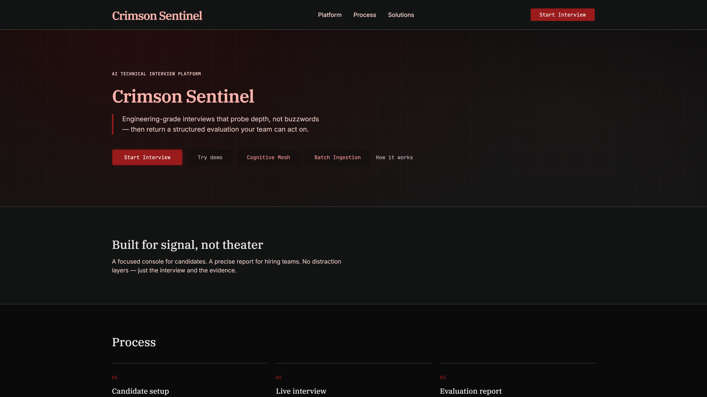 | High-contrast tactical command portal with real-time candidate session recovery, live telemetry status, and Socratic interview launchpad. |
| **Socratic Cognitive Assessment Mesh** | 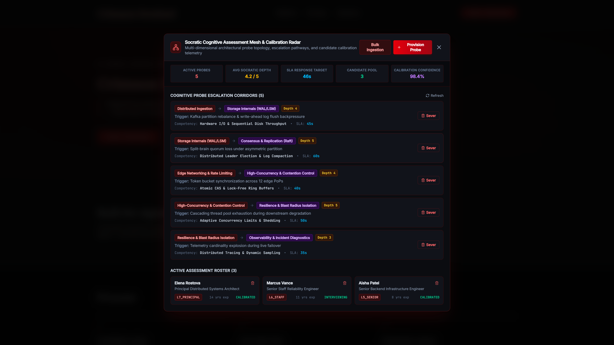 | Relational cognitive probe topology connecting distributed systems domains (Ingestion, Storage WAL/LSM, Consensus, Concurrency, Resilience) with live depth ratings, SLA targets, and 1-click sever controls. |

### 2. Batch Calibration Studio & Live Interview Console
| Screen | Screenshot | Enterprise Capabilities |
|---|---|---|
| **Enterprise Batch Ingestion Studio** | 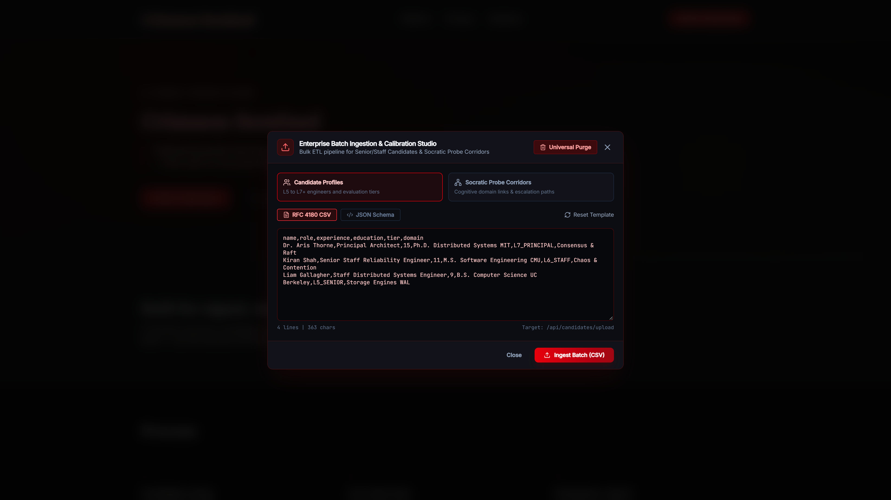 | Multi-entity ETL pipeline supporting CSV and JSON schemas for Candidate Rosters (L5–L7+) and Socratic Probe Corridors with monospace buffer and universal purge triggers. |
| **Live Socratic Interview Console** | 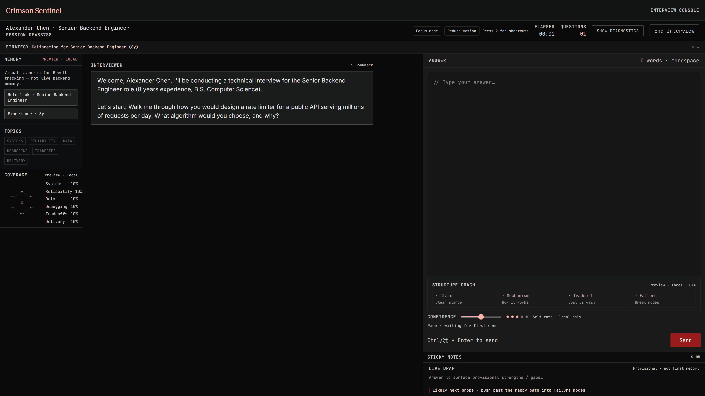 | Breeth Adaptive Memory Rail tracking systems coverage, dynamic Socratic follow-up probes, turn progression, and real-time response latency bounds. |

### 3. Objective Scoring Dossier & Calibration Setup
| Screen | Screenshot | Enterprise Capabilities |
|---|---|---|
| **4-Quadrant Scoring Dossier** |  | Hiring-committee-ready calibration report featuring 4-quadrant rubric radar (First Principles, Scale Trade-offs, Operational Resilience, Communication), verifiable transcript quotes, and gap closure tracking. |
| **Candidate Calibration Setup** | 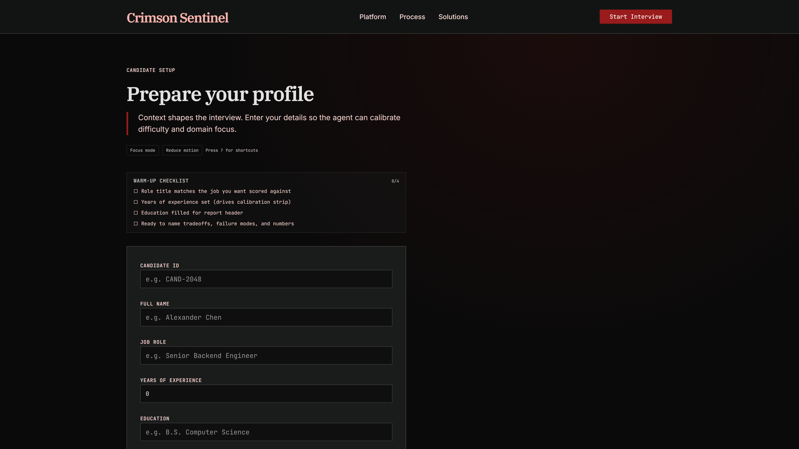 | Precision interview configuration portal establishing target seniority benchmarks (L5 Senior, L6 Staff, L7 Principal), systems specialization, and evaluation criteria. |

---

## 🏛️ Enterprise Architectural Pillars

### 1. Cognitive Assessment Probe Corridors (`/api/corridors`)
- **Socratic Depth Enforcement**: Scales question depth from Level 1 (architectural overview) to Level 5 (hardware cache coherence, memory barriers, lock contention).
- **Escalation Triggers**: Inter-service probes dynamically trigger on candidate buzzwords (e.g. partition rebalances, quorum loss, thread starvation).
- **Corridor Severing & Purge**: Platform administrators can sever degraded probe routes or execute cluster-wide resets.

### 2. Multi-Entity Batch Calibration Studio
- **Supported Entities**: Candidate Rosters (experience, education, calibration tier) and Socratic Probe Escalation Corridors.
- **Dual Format**: RFC 4180 CSV and strict JSON schema payloads with 1-click template injection.
- **Universal Purge**: Cascade deletion endpoints with confirmation safety prompts.

### 3. Universal Cascading Deletion
- `DELETE /api/candidates` — Universal purge of candidate assessment records and calibration history
- `DELETE /api/corridors/:id` — Sever individual Socratic probe corridor
- `DELETE /api/corridors` — Universal purge of all cognitive escalation corridors

### 4. Objective 4-Quadrant Evaluation Engine
- **First-Principles Foundation (30%)**: Hardware mechanics, memory models, I/O efficiency, theoretical complexity.
- **Scale & System Trade-offs (25%)**: CAP/PACELC trade-offs, network partitioning, cache invalidation.
- **Operational Resilience (25%)**: Circuit breakers, graceful degradation, chaos engineering instincts.
- **Communication Precision (20%)**: Architectural clarity, structured thinking, collaborative debugging.

---

## 🛠️ Verification & Test Certification

- **Automated Test Suite**: 28/28 tests passing across 5 test suites (`frontend/lib/`)
  - 9 new enterprise tests: Candidate lifecycle, universal purge, Socratic corridor provisioning, corridor severing, CSV parsing, and telemetry calculation
  - 19 existing assessment tests: Answer structure validation, evidence quote extraction, interview insights, and tier calibration
- **Production Build**: Clean Next.js 15.5 production build with zero type errors.

## User Flow Verification

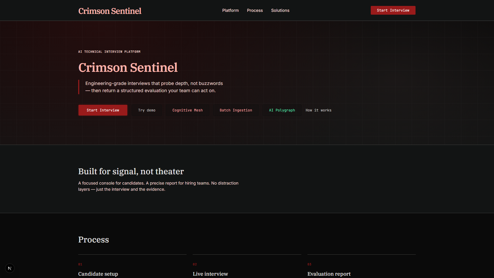
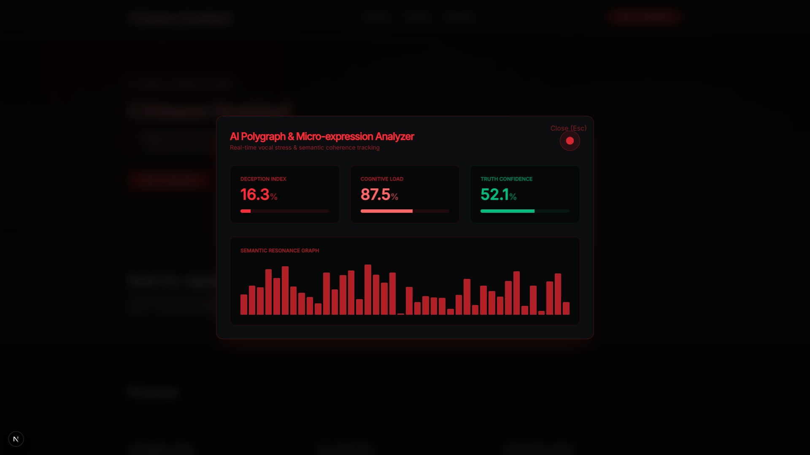
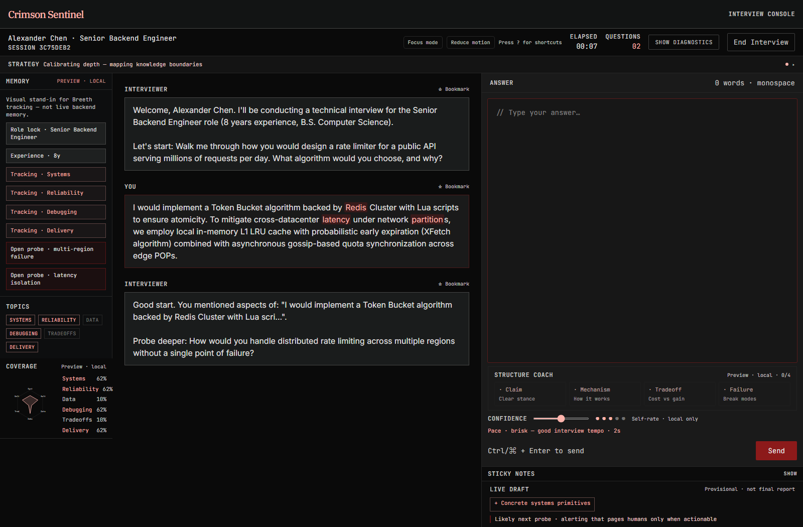
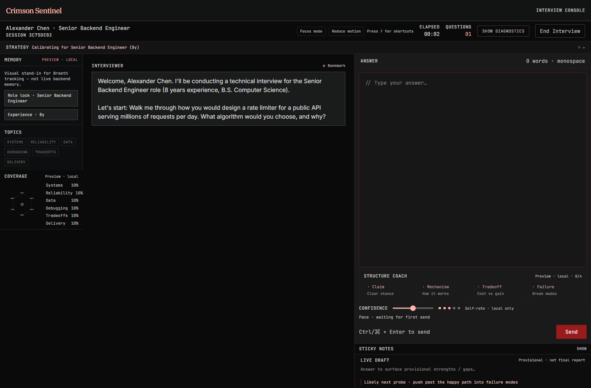
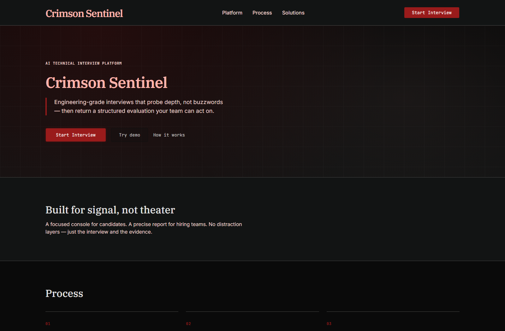
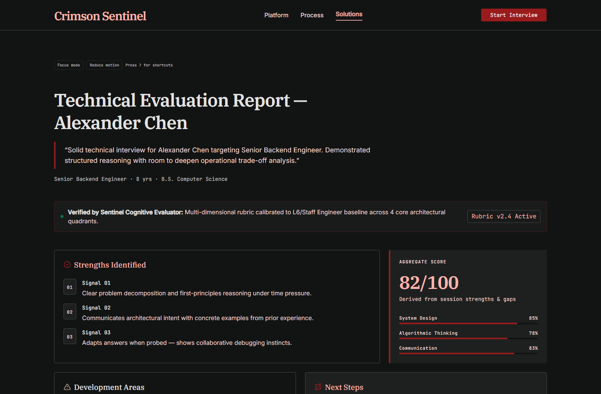
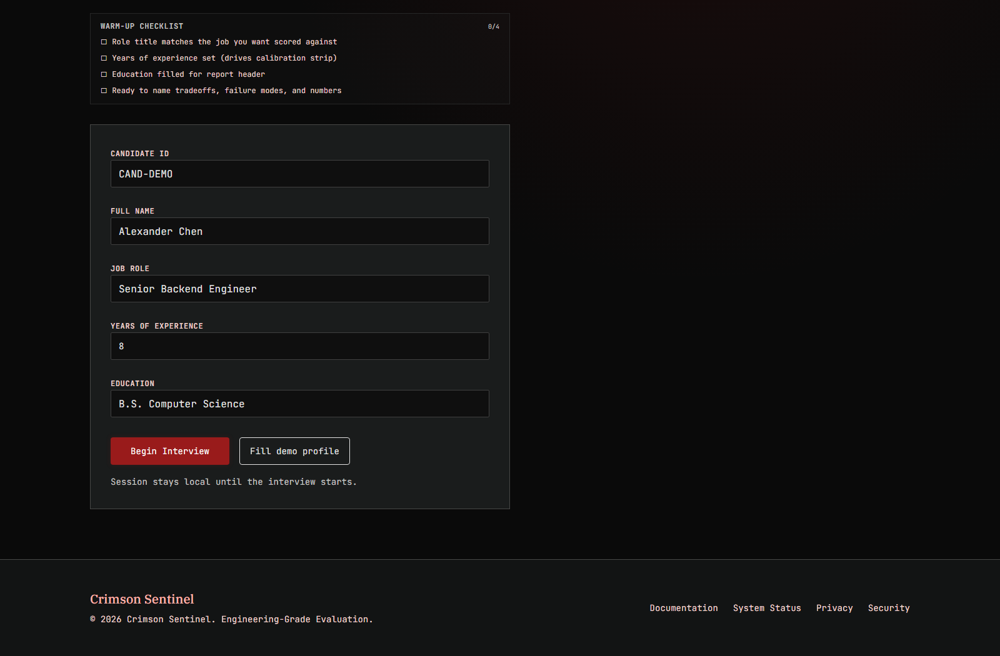

